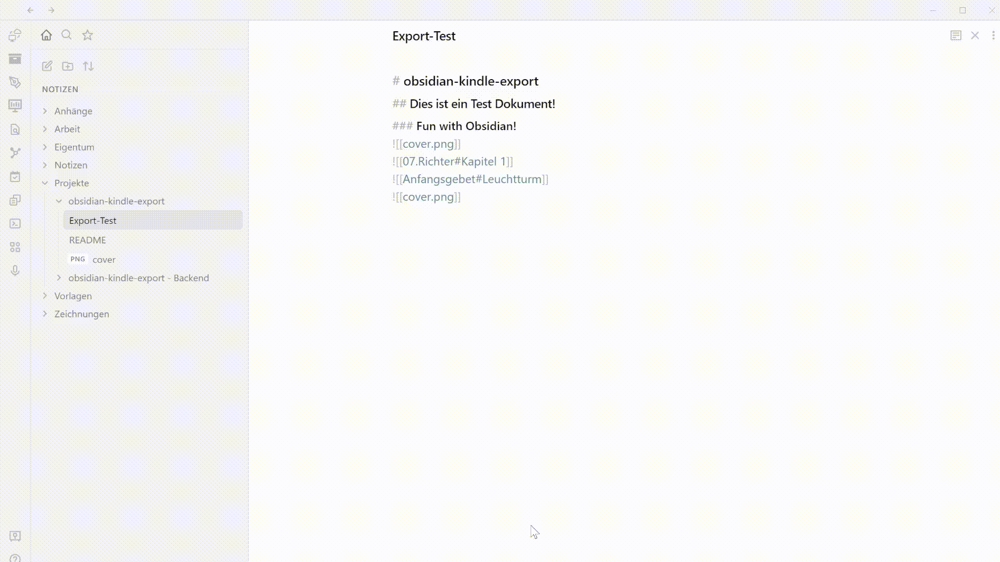

# Project 2: obsidian-kindle-export 
## An Obsidian-Plugin wich sends your Notes to your Kindle as .mobi File


[This is the exported .mobi File](Export-Test.mobi)
### Introduction
I was using Calibre and Pandoc-Export Plugin, but I was wondering about a short way to Export your .md Files in one Command an add all embedded Files. So you dont have to use a .pdf File. The Plugin creates a *Kindle: Export* Command, which sends all embedded Images and .md Files to a PHP Backend ([Host your own private PHP Backend!](https://github.com/SimeonLukas/Obsidian2Kindle)) which converts it to a .mobi File and sends it via Email to your Kindle. If you are not hosting on your own, you'll sent Data to my Server. Please be aware of this. I won't save or read your Data!

### To Do's:
- [x] Export Images
- [x] Export embedded .md Files
- [x] Obsidian Cover for the Books
- [x] Table of Contents *beta*
- [x] ```<div style="page-break-after: always;"></div>``` Working
- [x] ```&&Excludes&&``` are invisible
- [x] External Links
- [ ] External embedded Files
- [ ] Foldercover or Filecover
- [ ] .html Export (Archive)
- [ ] .epub Export (Pocketbook)
- [ ] .pdf Export (would be nice for IOS & Android)

### Just try it!
Fill in your Data for your Kindle and your Mailadress.
Read your Notes on your Kindle.


